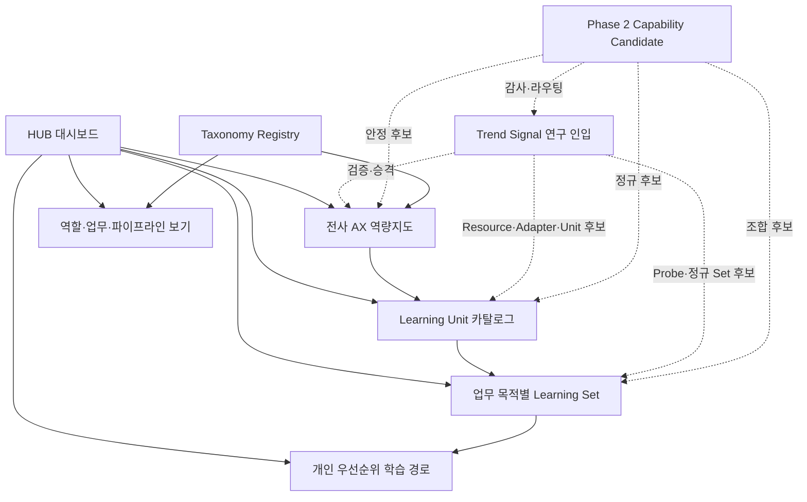

# AX 학습 시스템 아키텍처

## 1. 설계 목표

이 시스템은 전사 AX 역량의 폭을 보존하면서 현재 업무에 필요한 학습을 빠르게
우선 배정하고, 하나의 학습자료를 여러 업무에 재사용할 수 있어야 합니다.

## 2. 논리 구조



### 2.1 전사 AX 역량지도

- 기술과 비기술 역량의 전체 범위를 관리합니다.
- 현재 학습 여부와 관계없이 역량의 존재, 관계와 준비 상태를 보여줍니다.
- 개인 경로는 전체 지도의 부분집합이자 우선순위 보기입니다.

### 2.2 Learning Unit

기술, 개념, 패턴, 공학 실천, 언어, 라이브러리, 프레임워크, 프로토콜,
플랫폼, SaaS와 제품 기능을 정규 학습 단위로 관리합니다.

Unit은 특정 업무에 종속되지 않는 핵심 원리, 구현, 실패 진단, 검증,
운영 경계와 다른 맥락으로의 전이 능력을 제공합니다.

### 2.3 Learning Set

Set은 `workflow`, `pipeline`, `deliverable` 중 하나의 목적을 갖습니다.
여러 Unit 또는 특정 Resource를 참조하여 실제 업무와 유사한 종단 간 과정을 구성합니다.

Set은 다음 정보를 보유합니다.

- 업무 맥락, 현재 방식과 기대 결과
- 입력·출력, 단계와 승인 지점
- 필요한 Unit, Resource와 목표 숙련도
- 연결 실습, 통합 산출물과 수용 기준
- 위험, 비용, 중단·롤백과 실무 전이 지표

### 2.4 개인 학습 경로

다음 축을 조합하여 동적으로 구성합니다.

- 과정상 중요도
- 실행 우선순위
- 선행관계
- 현재 숙련도와 목표 수준
- 비즈니스 임팩트와 근거 신뢰도
- 학습 및 유지 비용

### 2.5 Trend Signal 연구 인입

Trend Signal은 네 학습 계층 앞에서 신흥 용어·개념·패턴을 정규화하고
정의·근거·중복·실무가치·승격 목적지를 판단합니다. 사용자 학습 경로로 직접
연결하지 않으며, 검증 결과만 역량지도·Resource·Adapter·Unit·Probe Set 또는
정규 Set으로 승격합니다. 관찰·중복·기각 이력도 삭제하지 않고 보존합니다.

### 2.6 Phase 2 Capability Candidate

Candidate는 Breadth 조사 중 발견한 역량의 staging 레코드입니다. 정규 학습
계층이나 이수 대상이 아니며, 출처·taxonomy·실무성 감사를 통과한 뒤에만 역량지도,
Resource, Adapter, Unit, Set 또는 Trend Signal로 라우팅합니다. 후보 제안과
실제 카탈로그 승격을 분리합니다.

### 2.7 Taxonomy Registry와 탐색 보기

Taxonomy Registry는 학습 계층이 아니라 전사 역량지도를 조립하는 분류
제어면입니다. 조사 렌즈, 잠정·정규 node, 계층·관련 관계, 별칭, 외부
교차검증 참고체계와 역할·업무 보기를 관리합니다.

- `research_lens`는 조사 시점의 범위이며 자동으로 정규 대분류로 간주하지 않습니다.
  Coverage와 정규화 Gate를 통과한 안정 ID만 canonical domain으로 전환합니다.
- Candidate와 Unit은 Registry node를 참조하고 태그는 보조 검색축으로 사용합니다.
- 프론트엔드·백엔드·데이터 엔지니어링 같은 직무 보기는 여러 node를 조합하며
  정규 콘텐츠나 분류를 복제하지 않습니다.
- 정규 트리, 역할 보기, 업무 보기와 선수관계 그래프는 같은 정본의 서로 다른
  projection입니다.
- 외부 프레임워크 매핑은 경계·누락 확인용이며 `verified` 전에는 동등성으로
  해석하지 않습니다.

## 3. 정규 콘텐츠와 참조

정규 콘텐츠는 한 곳에서만 관리합니다.

1. **안정 코어**: 공급자와 무관한 개념과 원리
2. **기술·제품 Adapter**: 특정 기술, 버전과 공급자 사용법
3. **업무 Overlay**: 업무별 맥락, 입출력, 연결과 통합 평가

Learning Set은 정규 Unit과 Resource를 ID와 정확한 콘텐츠 버전으로 참조합니다.
콘텐츠를 복사하여 별도 수정하지 않습니다.
MVP에서는 복잡한 버전 범위 해석 대신 정규 ID와 정확한 버전을 기록합니다.
향후 버전 해석기가 필요해지면 검증된 조합을 별도 잠금 파일에 저장합니다.

## 4. 항목 유형

초기 `item_type`은 다음과 같습니다.

- `concept`
- `pattern`
- `practice`
- `language`
- `library`
- `framework`
- `database`
- `protocol`
- `platform`
- `saas`
- `automation_platform`
- `product_feature`
- `tool`

유형만으로 관계를 추론하지 않습니다. Unit Schema를 정본으로 다음 관계를
사용합니다.

- `prerequisite`: 특정 숙련도의 선수 Unit을 요구합니다.
- `recommended_before`: 필수는 아니지만 먼저 학습하기를 권장합니다.
- `implements`: 개념이나 패턴을 구현합니다.
- `uses`: 다른 Unit을 사용합니다.
- `related_to`: 일반적인 관련성을 표시합니다.
- `alternative_to`: 교체 가능한 대안입니다.
- `integrates_with`: 통합 대상입니다.

평가 연결은 Unit의 `validation`과 Resource 참조로, 업무 적용은 Learning Set으로
표현합니다. 후속 버전 또는 대체 항목은 `lifecycle.superseded_by`에 정확한 ID와
버전을 기록합니다.

## 5. 메타데이터 계층

### 5.1 Unit 메타데이터

Unit의 정체성, 역량, 학습성과, 숙련도, 관계, 환경, 위험, Resource 목록,
검증, 출처와 생명주기를 관리합니다.

### 5.2 Set 메타데이터

업무 목표, 입출력, 비즈니스 임팩트, 단계별 Unit 참조, 요구 숙련도,
검증 게이트, 승인과 최종 수용 기준을 관리합니다.

### 5.3 Resource 메타데이터

각 챕터, 실습, 평가, 코드 예시, 교재와 시각화 파일의 경로, 형식,
관련 학습성과, 예상 시간, 접근성, 실행 검증 상태와 출처를 관리합니다.

### 5.4 Trend Signal 메타데이터

잠정 정의, claim과 evidence, 별칭과 중의성, 정의·효과 신뢰도, 실무 관련성,
후보 목적지, 검토 주기와 실제 승격 대상을 관리합니다. Signal 참조와 승격 대상은
정규 ID와 정확한 버전을 사용합니다.

### 5.5 Capability Candidate 메타데이터

Phase 2 후보의 정의·범위·분류·전이성, 목표 숙련도, 비즈니스 가설, 횡단
품질축, 근거와 임시 판정을 관리합니다. Candidate ID는 조사 이력을 보존하기
위한 것이며 제안된 Unit·Set ID를 실제로 선점하지 않습니다.

### 5.6 Taxonomy Registry 메타데이터

조사 렌즈와 잠정·정규 분류 node의 안정 ID, 정의, 포함·제외 범위, 부모·관련
관계, 별칭, 외부 참고체계, 탐색 보기와 변경 승인 정책을 관리합니다. Registry
상태는 학습 콘텐츠 상태와 분리합니다.

사용자 진행 상태는 콘텐츠 메타데이터와 분리합니다. 기술 변경으로 재학습이 필요해도
이전 완료 이력을 삭제하지 않고 `갱신 필요`로 표시합니다.

## 6. 권장 물리 구조

공개 학습 시스템과 비공개 원천은 저장소 경계부터 분리합니다. 상세 경로 계약,
HUB 실행 모드와 Git 정책은 `docs/architecture/public-private-storage.md`를
정본으로 합니다.

```text
AX/
  ax-learning-system/
    catalog/
      items/
        <canonical-unit-id>/
          unit.json
          resources/
          content/
          labs/
          tests/
    sets/
      <learning-set-id>/
        set.json
        overlays/
        lock.json
    taxonomy/
      taxonomy.json
    research/
      capability-survey/
        checkpoints/
        waves/
      signals/
        <signal-id>/
          signal.json
    schemas/
    dashboard/
      generated-public/
    docs/
  ax-learning-vault/
    overlays/
    sources/
      articles/
      documents/
    derived/
      embeddings/
      indexes/
    personal/
      progress/
    generated-private/
```

실제 폴더는 해당 단계의 콘텐츠가 생길 때 생성합니다. 빈 구조를 미리 대량 생성하지 않습니다.

## 7. HUB 대시보드

HUB는 다음 보기를 제공해야 합니다.

- 전사 역량지도와 카탈로그 준비 상태
- 정규 분류, 조사 렌즈와 역할·업무별 projection
- 기술·개념 Unit 및 관계
- 업무·파이프라인·산출물별 Learning Set
- 선수지식 DAG
- 필수·선택, 실행 우선순위와 추천 경로
- 학습 진행도와 획득 숙련도
- 예상 시간·비용과 비즈니스 임팩트
- 출처 확인일, 검증 상태, 지원 종료와 갱신 필요 상태
- 신흥 Signal의 조사 상태, 중의성, 효과 신뢰도, 재검토일과 승격 목적지

HUB는 메타데이터, 연구 Signal과 사용자 진행 상태에서 생성합니다.
생성 HTML이나 색인을 직접 편집하지 않습니다.

## 8. 상태 모델

초기 콘텐츠 상태는 다음과 같습니다.

`cataloged → scheduled → active → operational → reference | deprecated | archived`

정규 학습 콘텐츠에 편입된 뒤 불확실한 비즈니스 가치는 다음 흐름을 사용할 수 있습니다.

`cataloged → probe → pilot → operational → scale | reference`

Trend Signal은 콘텐츠 상태와 분리하여 다음 흐름을 사용합니다.

`captured → triaged → researching → substantiated → promoted`

필요에 따라 `watching`, `duplicate`, `rejected`, `archived`로 분기합니다.
정확한 전이와 승격 조건은 `schemas/trend-signal.schema.json`,
`docs/research/trend-signal-governance.md`와 검증기를 정본으로 합니다.

## 9. 자동 검증 대상

- 중복 ID와 깨진 참조
- 선행관계 순환
- 지원하지 않는 버전 조합
- 지원 종료·폐기 항목 참조
- 공식 출처 확인일과 실행 검증 만료
- 합격 기준이 없는 Unit, Resource 또는 Set
- 계정·비용·권한 정보가 빠진 SaaS 실습
- 상대경로 위반과 누락 파일
- 유사 콘텐츠의 복제 의심
- 지원 환경별 실행 및 smoke test
- Signal 상태 전이, claim–evidence 연결, 명칭 충돌과 중의성
- Signal 정확 버전 참조, 계층관계 순환과 실제 승격 대상
- Taxonomy node·외부 프레임워크·보기 참조, 계층 순환, 별칭 충돌과 폐기 node 참조
- Candidate·Unit의 대분류·하위분류 존재 여부와 부모 계층 정합성
